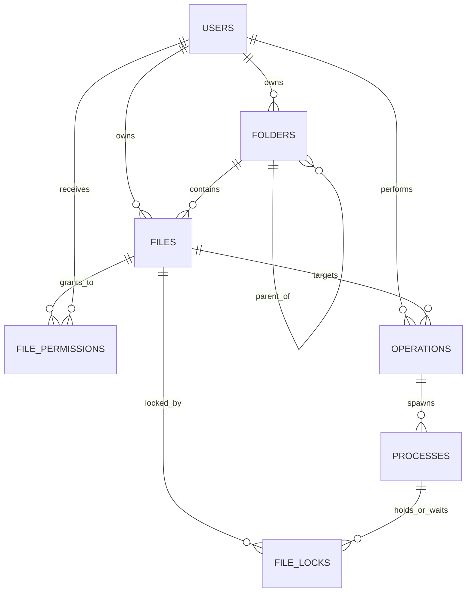

# ConflictCore — DBMS & Data Access Layer Integration Contract

This document provides the definitive technical integration contract for the ConflictCore engineering team:
- **Backend & REST APIs** (Anshika)
- **OS Process Manager & Scheduling** (Avni)
- **Lock Management & Deadlock Handling** (Avni / Jahnvi)
- **Frontend & Admin Dashboards** (Jahnvi)

---

## 1. Database Connection & Environment Configuration

The ConflictCore data layer uses `mysql2/promise` with automatic connection pooling. Configuration is driven via environment variables:

| Variable | Default Value | Description |
| :--- | :--- | :--- |
| `DB_HOST` | `localhost` | MySQL Server host address |
| `DB_PORT` | `3306` | MySQL Server port |
| `DB_USER` | `root` | MySQL username |
| `DB_PASSWORD` | `""` | MySQL user password |
| `DB_NAME` | `conflictcore_db` | Active schema database name |
| `DB_CONNECTION_LIMIT` | `10` | Max simultaneous pool connections |
| `DB_WAIT_FOR_CONNECTIONS`| `true` | Queue requests when pool is full |
| `DB_QUEUE_LIMIT` | `0` | Max queue size (0 = unlimited) |

A template configuration file is provided at `backend/.env.example`. Copy it to `backend/.env` for your local environment:
```powershell
cp backend/.env.example backend/.env
```

---

## 2. Core Tables & Foreign Key Relationships

The database strictly manages **7 core tables**:



### Foreign Key Cascade & Constraint Rules:
1. `FOLDERS.owner_id → USERS.user_id` (`ON DELETE RESTRICT`): Prevents accidental deletion of users who own directory hierarchies.
2. `FOLDERS.parent_folder_id → FOLDERS.folder_id` (`ON DELETE CASCADE`): Recursively cleans subdirectories upon parent folder deletion.
3. `FILES.folder_id → FOLDERS.folder_id` (`ON DELETE SET NULL`): Files are preserved as root files if their directory is removed.
4. `FILES.owner_id → USERS.user_id` (`ON DELETE RESTRICT`): Users owning active files cannot be dropped without file reassignment.
5. `FILE_PERMISSIONS.file_id → FILES.file_id` (`ON DELETE CASCADE`): Deleting a file automatically clears all granted user permissions.
6. `OPERATIONS.file_id → FILES.file_id` (`ON DELETE CASCADE`): Operations targeting a file cascade on file deletion.
7. `PROCESSES.operation_id → OPERATIONS.operation_id` (`ON DELETE CASCADE`): Processes represent execution units of operations.
8. `FILE_LOCKS.file_id → FILES.file_id` (`ON DELETE CASCADE`), `process_id → PROCESSES.process_id` (`ON DELETE CASCADE`): Locks tie files to running/waiting processes.

---

## 3. Data Access API Specification (All 7 Repositories)

Import repositories through the unified entry point:

```javascript
const {
  userRepository,
  folderRepository,
  fileRepository,
  permissionRepository,
  operationRepository,
  processRepository,
  lockRepository,
  relationalQueries,
  withTransaction,
} = require('./backend/src/db'); // or require('../db') from backend/src/
```

Every repository function optionally accepts an active `connection` instance as its last parameter (`[conn]`) to participate in transactions. If omitted, the function acquires a connection from the pool automatically.

---

### A. `userRepository`
- **Database Table:** `USERS`
- **Purpose:** User account management, authentication hashes, and roles (`ADMIN`, `USER`, `COLLABORATOR`).

| Function | Parameters | Return Value | Supports `conn`? |
| :--- | :--- | :--- | :---: |
| `createUser(data, [conn])` | `{ username, email, password_hash, role?, status? }` | `Promise<User>` | Yes |
| `findUserById(userId, [conn])` | `userId: number` | `Promise<User \| null>` | Yes |
| `findUserByEmail(email, [conn])` | `email: string` | `Promise<User \| null>` | Yes |
| `findUserByUsername(username, [conn])` | `username: string` | `Promise<User \| null>` | Yes |
| `listUsers(filters?, [conn])` | `{ role?, status? }` | `Promise<Array<User>>` | Yes |
| `updateUser(userId, updates, [conn])` | `userId: number, updates: Object` | `Promise<User \| null>` | Yes |
| `deactivateUser(userId, [conn])` | `userId: number` | `Promise<User \| null>` | Yes |
| `deleteUser(userId, [conn])` | `userId: number` | `Promise<boolean>` | Yes |

```javascript
// Example:
const user = await userRepository.createUser({
  username: 'alex_dev',
  email: 'alex@conflictcore.io',
  password_hash: '$2b$12$...',
  role: 'USER'
});
```

---

### B. `folderRepository`
- **Database Table:** `FOLDERS`
- **Purpose:** Self-referencing directory hierarchy supporting root and nested subfolders.

| Function | Parameters | Return Value | Supports `conn`? |
| :--- | :--- | :--- | :---: |
| `createFolder(data, [conn])` | `{ folder_name, parent_folder_id?, owner_id }` | `Promise<Folder>` | Yes |
| `findFolderById(folderId, [conn])` | `folderId: number` | `Promise<Folder \| null>` | Yes |
| `listFolders(ownerId?, [conn])` | `ownerId?: number` | `Promise<Array<Folder>>` | Yes |
| `getChildFolders(parentFolderId?, [conn])` | `parentFolderId?: number \| null` | `Promise<Array<Folder>>` | Yes |
| `updateFolder(folderId, updates, [conn])` | `folderId: number, updates: Object` | `Promise<Folder \| null>` | Yes |
| `deleteFolder(folderId, [conn])` | `folderId: number` | `Promise<boolean>` | Yes |

```javascript
// Example: Get root directories vs subfolders
const rootFolders = await folderRepository.getChildFolders(null);
const subFolders = await folderRepository.getChildFolders(rootFolders[0].folder_id);
```

---

### C. `fileRepository`
- **Database Table:** `FILES`
- **Purpose:** Logical file records with MIME types, byte sizes, physical paths, and statuses.

| Function | Parameters | Return Value | Supports `conn`? |
| :--- | :--- | :--- | :---: |
| `createFile(data, [conn])` | `{ file_name, folder_id?, owner_id, file_size_bytes?, file_path, mime_type?, status? }` | `Promise<File>` | Yes |
| `getFileById(fileId, [conn])` | `fileId: number` | `Promise<File \| null>` | Yes |
| `listFiles(filters?, [conn])` | `{ folder_id?, owner_id?, status? }` | `Promise<Array<File>>` | Yes |
| `updateFile(fileId, updates, [conn])` | `fileId: number, updates: Object` | `Promise<File \| null>` | Yes |
| `deleteFile(fileId, [conn])` | `fileId: number` | `Promise<boolean>` | Yes |

```javascript
// Example:
const file = await fileRepository.createFile({
  file_name: 'matrix.csv',
  folder_id: 2,
  owner_id: 1,
  file_size_bytes: 1024,
  file_path: '/datasets/matrix.csv',
  mime_type: 'text/csv'
});
```

---

### D. `permissionRepository`
- **Database Table:** `FILE_PERMISSIONS`
- **Purpose:** Granular access control (`READ`, `WRITE`, `EXECUTE`, `ADMIN`, `READ_WRITE`).

| Function | Parameters | Return Value | Supports `conn`? |
| :--- | :--- | :--- | :---: |
| `grantPermission(data, [conn])` | `{ file_id, user_id, permission_type, granted_by?, expires_at? }` | `Promise<Permission>` | Yes |
| `getPermissionById(permissionId, [conn])` | `permissionId: number` | `Promise<Permission \| null>` | Yes |
| `checkPermission(fileId, userId, requiredPerm, [conn])` | `fileId: number, userId: number, requiredPerm: string` | `Promise<boolean>` | Yes |
| `updatePermission(permissionId, updates, [conn])` | `permissionId: number, updates: Object` | `Promise<Permission \| null>` | Yes |
| `revokePermission(permissionId, [conn])` | `permissionId: number` | `Promise<boolean>` | Yes |
| `getPermissionsByFile(fileId, [conn])` | `fileId: number` | `Promise<Array<Permission>>` | Yes |

```javascript
// Example: Check if user has WRITE access (returns true if user is owner or has WRITE/ADMIN grant)
const canWrite = await permissionRepository.checkPermission(fileId, userId, 'WRITE');
```

---

### E. `operationRepository`
- **Database Table:** `OPERATIONS`
- **Purpose:** High-level file action queue and lifecycle tracking.

| Function | Parameters | Return Value | Supports `conn`? |
| :--- | :--- | :--- | :---: |
| `createOperation(data, [conn])` | `{ user_id, file_id?, operation_type, status?, priority?, details? }` | `Promise<Operation>` | Yes |
| `retrieveOperation(operationId, [conn])` | `operationId: number` | `Promise<Operation \| null>` | Yes |
| `updateOperationStatus(operationId, status, completedAt?, [conn])` | `operationId: number, status: string, completedAt?: Date \| null` | `Promise<Operation \| null>` | Yes |
| `listOperationsByUser(userId, [conn])` | `userId: number` | `Promise<Array<Operation>>` | Yes |
| `listOperationsByStatus(status, [conn])` | `status: string` | `Promise<Array<Operation>>` | Yes |

- **Supported `operation_type` values:** `UPLOAD`, `DOWNLOAD`, `EDIT`, `DELETE`, `MOVE`, `SHARE`.
- **Supported `status` values:** `PENDING`, `QUEUED`, `EXECUTING`, `COMPLETED`, `FAILED`, `ABORTED`.
- Note: Setting status to `COMPLETED`, `FAILED`, or `ABORTED` automatically stamps `completed_at = CURRENT_TIMESTAMP`.

```javascript
// Example:
const op = await operationRepository.createOperation({
  user_id: 2,
  file_id: 3,
  operation_type: 'EDIT',
  status: 'PENDING',
  priority: 5,
  details: { diff_lines: 12, reason: 'syntax_fix' }
});
```

---

### F. `processRepository`
- **Database Table:** `PROCESSES`
- **Purpose:** OS process scheduling representation and state tracking.

| Function | Parameters | Return Value | Supports `conn`? |
| :--- | :--- | :--- | :---: |
| `createProcess(data, [conn])` | `{ operation_id, pid_alias, state?, priority?, cpu_burst_time?, memory_allocated_kb? }` | `Promise<Process>` | Yes |
| `retrieveProcess(processId, [conn])` | `processId: number` | `Promise<Process \| null>` | Yes |
| `retrieveProcessByPid(pidAlias, [conn])` | `pidAlias: string` | `Promise<Process \| null>` | Yes |
| `retrieveProcessesByState(state, [conn])` | `state: string` | `Promise<Array<Process>>` | Yes |
| `getProcessByOperationId(operationId, [conn])` | `operationId: number` | `Promise<Process \| null>` | Yes |
| `updateProcessState(processId, state, updates?, [conn])` | `processId: number, state: string, updates?: Object` | `Promise<Process \| null>` | Yes |

- **Supported `state` values:** `NEW`, `READY`, `RUNNING`, `WAITING`, `TERMINATED`, `KILLED`.
- Note: Transitioning to `RUNNING` automatically records `started_at`. Transitioning to `TERMINATED` or `KILLED` automatically records `finished_at`.

```javascript
// Example: Transition process state
const proc = await processRepository.updateProcessState(processId, 'RUNNING');
```

---

### G. `lockRepository`
- **Database Table:** `FILE_LOCKS`
- **Purpose:** File lock persistence and contention queue tracking.

| Function | Parameters | Return Value | Supports `conn`? |
| :--- | :--- | :--- | :---: |
| `acquireOrRequestLock(data, [conn])` | `{ file_id, process_id, lock_type?, lock_status? }` | `Promise<Lock>` | Yes |
| `findLockById(lockId, [conn])` | `lockId: number` | `Promise<Lock \| null>` | Yes |
| `retrieveActiveLocks(fileId?, [conn])` | `fileId?: number` | `Promise<Array<Lock>>` | Yes |
| `retrieveWaitingLocks(fileId?, [conn])` | `fileId?: number` | `Promise<Array<Lock>>` | Yes |
| `updateLockStatus(lockId, lockStatus, updates?, [conn])` | `lockId: number, lockStatus: string, updates?: Object` | `Promise<Lock \| null>` | Yes |
| `releaseLock(lockId, [conn])` | `lockId: number` | `Promise<Lock \| null>` | Yes |

- **Supported `lock_type` values:** `SHARED` (read), `EXCLUSIVE` (write).
- **Supported `lock_status` values:** `WAITING`, `ACQUIRED`, `RELEASED`, `ABORTED`.
- Note: Setting status to `ACQUIRED` stamps `acquired_at = CURRENT_TIMESTAMP`. Setting to `RELEASED` stamps `released_at = CURRENT_TIMESTAMP`.

```javascript
// Example: Requesting exclusive write lock
const lock = await lockRepository.acquireOrRequestLock({
  file_id: 2,
  process_id: 3,
  lock_type: 'EXCLUSIVE',
  lock_status: 'WAITING'
});
```

---

## 4. Contract for the Backend & Controller Layer

The following step-by-step examples demonstrate how backend controllers and service handlers consume the DBMS layer.

```javascript
const {
  userRepository,
  fileRepository,
  operationRepository,
  processRepository,
  lockRepository,
  withTransaction
} = require('./src/db');
```

### 1. Create an Operation
```javascript
async function initiateFileEdit(userId, fileId) {
  return await operationRepository.createOperation({
    user_id: userId,
    file_id: fileId,
    operation_type: 'EDIT',
    status: 'QUEUED',
    priority: 3,
    details: { timestamp: new Date() }
  });
}
```

### 2. Create the Corresponding Process
```javascript
async function spawnProcessForOperation(operationId, pidAlias) {
  return await processRepository.createProcess({
    operation_id: operationId,
    pid_alias: pidAlias, // e.g. `PROC-${Date.now()}`
    state: 'READY',
    priority: 3,
    cpu_burst_time: 40,
  });
}
```

### 3. Request a File Lock
```javascript
async function requestFileLock(fileId, processId, lockType = 'EXCLUSIVE') {
  return await lockRepository.acquireOrRequestLock({
    file_id: fileId,
    process_id: processId,
    lock_type: lockType,   // 'SHARED' or 'EXCLUSIVE'
    lock_status: 'WAITING' // Queued until scheduler/lock manager grants it
  });
}
```

### 4. Read File and User Information
```javascript
async function getFileContext(fileId) {
  const file = await fileRepository.getFileById(fileId);
  const owner = await userRepository.findUserById(file.owner_id);
  return { file, owner };
}
```

### 5. Update Operation and Process Status
```javascript
async function markProcessRunning(operationId, processId) {
  await operationRepository.updateOperationStatus(operationId, 'EXECUTING');
  await processRepository.updateProcessState(processId, 'RUNNING');
}
```

### 6. Release a Lock
```javascript
async function completeProcessAndReleaseLock(lockId, processId, operationId) {
  await lockRepository.releaseLock(lockId);
  await processRepository.updateProcessState(processId, 'TERMINATED');
  await operationRepository.updateOperationStatus(operationId, 'COMPLETED');
}
```

---

## 5. Transaction Integration Contract & Best Practice

When multiple database changes must succeed or fail together, wrap them using `withTransaction`.

> [!IMPORTANT]
> All repository calls within the transaction MUST receive the `conn` parameter. Omitting `conn` will cause that operation to execute outside the transaction boundary!

```javascript
const { withTransaction, operationRepository, processRepository, lockRepository } = require('./src/db');

async function createOperationAndProcessAtomically(userId, fileId, pidAlias) {
  return await withTransaction(async (conn) => {
    // Step 1: Create operation record within transaction
    const op = await operationRepository.createOperation({
      user_id: userId,
      file_id: fileId,
      operation_type: 'EDIT',
      status: 'QUEUED',
      priority: 4,
    }, conn);

    // Step 2: Spawn process representation within transaction
    const proc = await processRepository.createProcess({
      operation_id: op.operation_id,
      pid_alias: pidAlias,
      state: 'WAITING',
      priority: 4,
    }, conn);

    // Step 3: Request lock representation within transaction
    const lock = await lockRepository.acquireOrRequestLock({
      file_id: fileId,
      process_id: proc.process_id,
      lock_type: 'EXCLUSIVE',
      lock_status: 'WAITING',
    }, conn);

    // If all succeed, withTransaction executes COMMIT automatically
    return { op, proc, lock };
  });
  // If ANY error occurs above, withTransaction catches it, executes ROLLBACK,
  // releases the connection, and re-throws the error.
}
```

---

## 6. Subsystem Boundaries & Team Division

### Lock / Concurrency Contract (for Lock & Deadlock Developers)
- **DBMS Responsibility:** Persistent storage of lock states (`SHARED`, `EXCLUSIVE`, `ACQUIRED`, `WAITING`, `RELEASED`, `ABORTED`) and fast queries via `retrieveActiveLocks(fileId)` and `retrieveWaitingLocks(fileId)`.
- **Lock/Deadlock Module Responsibility:** 
  - Conflict arbitration (e.g. mutual exclusion rules).
  - Deadlock cycle detection and Wait-For Graph algorithms.
  - Victim selection, process abort, and lock release coordination.
- **Rule:** The DB layer stores and queries lock states; it does NOT calculate deadlock graphs.

### Process / Scheduling Contract (for OS / Scheduler Developers)
- **DBMS Responsibility:** Persistence of process state (`NEW`, `READY`, `RUNNING`, `WAITING`, `TERMINATED`, `KILLED`), CPU burst times, memory sizes, priority, and timestamps.
- **Scheduler Module Responsibility:**
  - Algorithm implementation (FCFS queue, Shortest Job First sorting, Priority preemptive/non-preemptive scheduling).
  - CPU turnaround, waiting, and response time calculations.
- **Rule:** The DB layer stores and queries process states; it does NOT execute scheduling algorithms.

### Operations Contract (for Backend Developers)
- **DBMS Responsibility:** Persisting actions (`UPLOAD`, `DOWNLOAD`, `EDIT`, `DELETE`, `MOVE`, `SHARE`) and lifecycle state transitions.
- **Backend Responsibility:**
  - REST endpoint routing, body parsing, multipart file uploads, and session authentication.

---

## 7. Error Handling & Standard MySQL Codes

| MySQL Error Code | Meaning | Recommended Action |
| :--- | :--- | :--- |
| `ER_DUP_ENTRY` | Unique constraint violation | Email/username exists, or duplicate `pid_alias`. Return HTTP 409 Conflict. |
| `ER_NO_REFERENCED_ROW_2` | Foreign key reference missing | Specified `user_id`, `folder_id`, or `file_id` does not exist. Return HTTP 404. |
| `ER_ROW_IS_REFERENCED_2` | Parent record in use | Cannot delete user or folder that still owns active child records. Return HTTP 409. |
| `CHECK_CONSTRAINT_VIOLATED` | Constraint violated | Invalid role, status, priority (not 1..10), or negative file size. Return HTTP 400. |

---

## 8. Verification Commands

To verify the database layer locally:

```powershell
# 1. Run Data Access Layer Tests (Node.js):
node backend/tests/db.test.js

# 2. Run Database SQL & Table Verification (Python):
python db/verify.py
```
