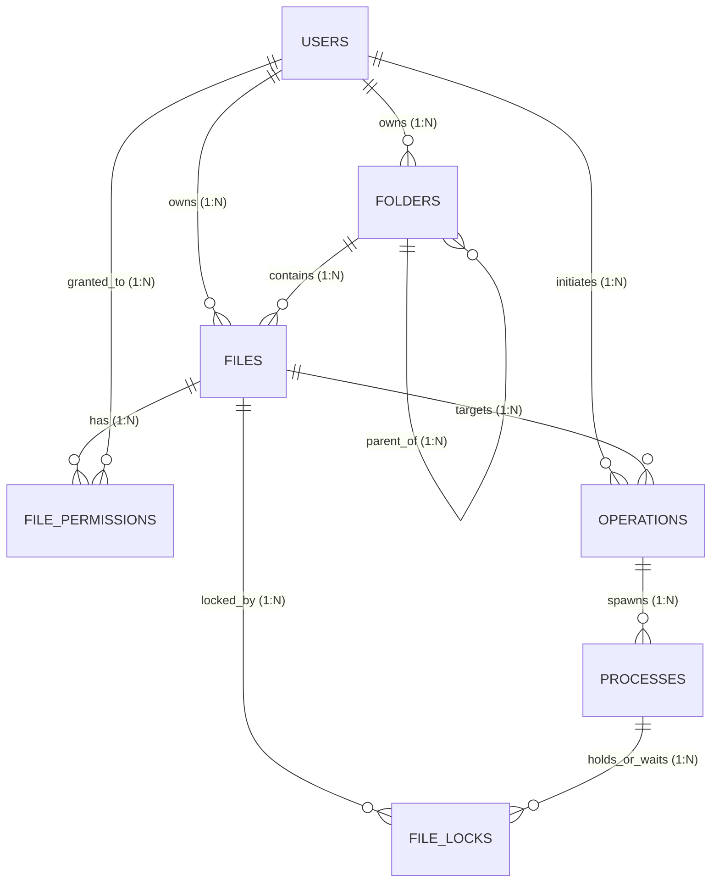

# ConflictCore — DBMS / Data Access Layer

This module defines the relational database architecture, schema migrations, seed data, and data access repositories for **ConflictCore** (Conflict Resolution-Based Multi-User File Management System).

---

## 1. Database Architecture & Core Entities

The system establishes the **7 core tables** required by the multi-user file management system:

| Table Name | Primary Key | Key Relationships | Purpose |
| :--- | :--- | :--- | :--- |
| **`USERS`** | `user_id` (INT) | Referenced by `FOLDERS`, `FILES`, `OPERATIONS`, `FILE_PERMISSIONS` | User accounts, authentication hashes, and roles (`ADMIN`, `USER`, `COLLABORATOR`). |
| **`FOLDERS`** | `folder_id` (INT) | `owner_id` → `USERS`, `parent_folder_id` → `FOLDERS` | Hierarchical directory tree supporting nested subfolders and folder ownership. |
| **`FILES`** | `file_id` (INT) | `folder_id` → `FOLDERS`, `owner_id` → `USERS` | Logical file metadata, system path, MIME type, size, and status. |
| **`FILE_PERMISSIONS`** | `permission_id` (INT) | `file_id` → `FILES`, `user_id` → `USERS`, `granted_by` → `USERS` | Granular access control (`READ`, `WRITE`, `EXECUTE`, `ADMIN`, `READ_WRITE`). |
| **`OPERATIONS`** | `operation_id` (INT) | `user_id` → `USERS`, `file_id` → `FILES` | High-level file operations (`UPLOAD`, `DOWNLOAD`, `EDIT`, `DELETE`, `MOVE`, `SHARE`) queued for processing. |
| **`PROCESSES`** | `process_id` (INT) | `operation_id` → `OPERATIONS` | Operating system process representation (`NEW`, `READY`, `RUNNING`, `WAITING`, `TERMINATED`, `KILLED`) for scheduling simulation. |
| **`FILE_LOCKS`** | `lock_id` (INT) | `file_id` → `FILES`, `process_id` → `PROCESSES` | Concurrency lock records (`SHARED`, `EXCLUSIVE`) tracking `ACQUIRED` and `WAITING` lock states. |

---

## 2. Entity-Relationship (ER) Diagram



---

## 3. Directory Layout

```
conflictcore/
├── db/
│   ├── README.md                          # Database architecture and setup instructions
│   ├── INTEGRATION.md                     # Team integration contract and repository API reference
│   ├── walkthrough.md                     # Verification walkthrough documentation
│   ├── schema.sql                         # Full idempotent schema DDL
│   ├── verify.py                          # Standalone Python database verification runner
│   ├── migrations/
│   │   └── 001_initial_schema.sql         # Initial core schema migration script
│   ├── seeds/
│   │   └── seed.sql                       # Realistic demo data for all 7 tables
│   └── queries/
│       └── crud_and_relational_tests.sql  # Automated CRUD and relational test query suite
└── backend/
    ├── package.json                       # Backend module configuration
    ├── .env.example                       # Environment variable template
    ├── src/
    │   └── db/
    │       ├── connection.js              # MySQL connection pool manager
    │       ├── transactions.js            # withTransaction atomic execution helper
    │       ├── index.js                   # Unified export of pool, transactions & repos
    │       ├── queries/
    │       │   └── relationalQueries.js   # Multi-table relational query suite
    │       └── repositories/              # Repositories for all 7 core tables
    │           ├── userRepository.js
    │           ├── folderRepository.js
    │           ├── fileRepository.js
    │           ├── permissionRepository.js
    │           ├── operationRepository.js
    │           ├── processRepository.js
    │           └── lockRepository.js
    └── tests/
        └── db.test.js                     # 11-scenario automated data access layer test suite
```

---

## 4. Database Setup & Execution Guide

### Prerequisites
- **MySQL Server 8.0+ or 9.x** (Running on default port `3306`)
- Node.js v18+ (v24 tested)
- Python 3.x

### Step 1: Create Database & Initialize Schema
Run either `schema.sql` or the migration script `migrations/001_initial_schema.sql`:

```powershell
cmd /c "mysql -u root -p < db/schema.sql"
```

### Step 2: Ingest Realistic Seed Data
Populate demo users, folders, files, permissions, operations, processes, and lock scenarios:

```powershell
cmd /c "mysql -u root -p conflictcore_db < db/seeds/seed.sql"
```

### Step 3: Run Verification Test Suites
```powershell
# Run Node.js repository & transaction tests:
node backend/tests/db.test.js

# Run Python schema & SQL test suite:
python db/verify.py
```

---

## 5. Team Integration Contract

For detailed repository function signatures, parameter types, transaction boundaries, and controller examples, see:
👉 **[db/INTEGRATION.md](INTEGRATION.md)**
