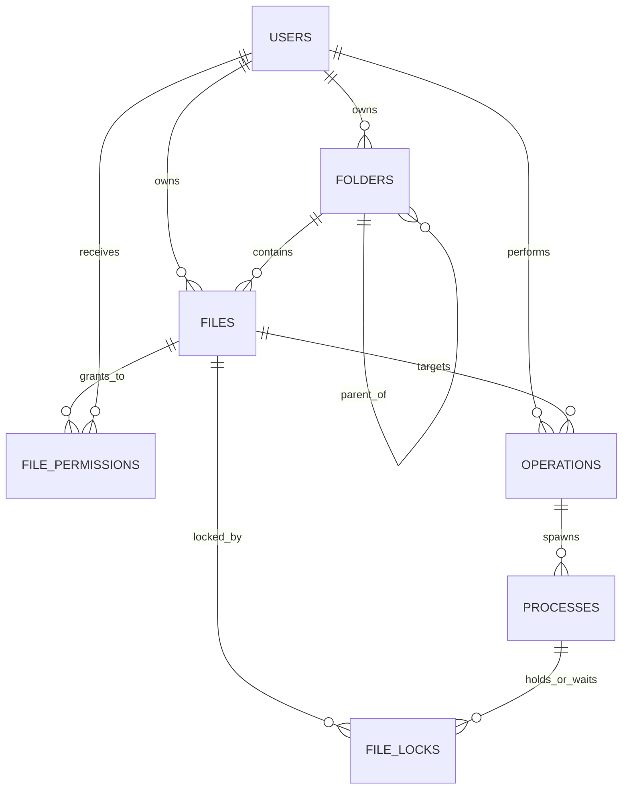

# Walkthrough — ConflictCore MySQL Database Architecture & Data Layer

The ConflictCore relational database foundation has been fully established on MySQL, seeded with realistic multi-user demonstration data, and verified with an automated CRUD and relational test suite.

---

## 1. Files in Database Module

1. **`001_initial_schema.sql`** (`db/migrations/001_initial_schema.sql`):
   Migration script creating all 7 core tables with InnoDB engine, utf8mb4 encoding, foreign keys, CHECK constraints, and performance indexes.
2. **`schema.sql`** (`db/schema.sql`):
   Idempotent root DDL schema script to initialize `conflictcore_db`.
3. **`seed.sql`** (`db/seeds/seed.sql`):
   Realistic sample data across all 7 tables, including active and waiting file locks demonstrating concurrency contention.
4. **`crud_and_relational_tests.sql`** (`db/queries/crud_and_relational_tests.sql`):
   Test suite covering full CRUD (Insert, Read, Update, Delete) and the 7 required multi-table relational queries.
5. **`README.md`** (`db/README.md`):
   DBMS documentation covering table schemas, foreign key relationships, setup commands, and integration contracts for backend, scheduler, and deadlock teammates.
6. **`verify.py`** (`db/verify.py`):
   Automated end-to-end Python test runner verifying migrations, seeds, row counts, and query execution against local MySQL.

---

## 2. Database Tables Overview

All **7 core tables** are active in `conflictcore_db`:

| # | Table Name | Engine | Primary Key | Description |
|---|------------|--------|-------------|-------------|
| 1 | **`USERS`** | InnoDB | `user_id` (INT) | User credentials, roles (`ADMIN`, `USER`, `COLLABORATOR`), and account statuses. |
| 2 | **`FOLDERS`** | InnoDB | `folder_id` (INT) | Directory tree structure owned by users, supporting self-referencing nested subfolders (`parent_folder_id`). |
| 3 | **`FILES`** | InnoDB | `file_id` (INT) | Logical file records located in folders, tracked with MIME types, sizes, paths, and statuses. |
| 4 | **`FILE_PERMISSIONS`** | InnoDB | `permission_id` (INT) | Granular user privileges (`READ`, `WRITE`, `EXECUTE`, `ADMIN`, `READ_WRITE`) per file. |
| 5 | **`OPERATIONS`** | InnoDB | `operation_id` (INT) | High-level file actions (`UPLOAD`, `DOWNLOAD`, `EDIT`, `DELETE`, `MOVE`, `SHARE`) initiated by users. |
| 6 | **`PROCESSES`** | InnoDB | `process_id` (INT) | Simulated OS processes (`NEW`, `READY`, `RUNNING`, `WAITING`, `TERMINATED`, `KILLED`) spawned by operations. |
| 7 | **`FILE_LOCKS`** | InnoDB | `lock_id` (INT) | Concurrency lock records (`SHARED`, `EXCLUSIVE`) tracking `ACQUIRED` and `WAITING` states. |

---

## 3. Relationships & Constraints



- **Folder Hierarchy**: `FOLDERS.parent_folder_id → FOLDERS.folder_id` (`ON DELETE CASCADE`) enables nested folders, while `owner_id → USERS.user_id` binds ownership.
- **File Ownership & Placement**: `FILES.folder_id → FOLDERS.folder_id` (`ON DELETE SET NULL`) preserves files if a folder is deleted; `owner_id → USERS.user_id` prevents deleting users with active files (`RESTRICT`).
- **Access Control**: `FILE_PERMISSIONS` enforces `UNIQUE(file_id, user_id, permission_type)` and verifies allowed permission types via `CHECK` constraints.
- **Operations & Processes**: `OPERATIONS` logs file action intent with priorities (1–10). `PROCESSES` represents OS execution units (`pid_alias` unique constraint, CPU burst, priority, and lifecycle state).
- **Concurrency & Locking**: `FILE_LOCKS` links `file_id` and `process_id` with `lock_status IN ('WAITING', 'ACQUIRED', 'RELEASED', 'ABORTED')` and `lock_type IN ('SHARED', 'EXCLUSIVE')`, capturing lock contention directly at the database layer.

---

## 4. Verification & Test Execution Results

The automated test runner (`python db/verify.py`) executed against local MySQL instance (`MySQL97`) on `localhost:3306`:

### Verification Output:
```
==================================================
ConflictCore DBMS Verification
==================================================

[Step 1] Applying migration: db/migrations/001_initial_schema.sql...
Schema applied successfully.

[Step 2] Checking 7 core tables in database...
Detected 7 tables: file_locks, file_permissions, files, folders, operations, processes, users
All 7 core tables confirmed!

[Step 3] Loading seed data: db/seeds/seed.sql...
Seed data loaded successfully.

[Step 4] Checking table row counts...
tbl	cnt
USERS	5
FOLDERS	5
FILES	5
FILE_PERMISSIONS	9
OPERATIONS	7
PROCESSES	6
FILE_LOCKS	5

[Step 5] Executing CRUD and relational test query suite...
CRUD & Relational Queries executed with 0 errors!

Verification Complete: All DBMS verification requirements passed successfully.
```

### Relational Queries Demonstrated:
1. **Files belonging to a user (`user_id = 2`)**:
   - `architecture_v1.pdf`, `priority_queue.h`, `scheduler_core.c`.
2. **Files inside a folder (`folder_id = 3, Kernel_Source`)**:
   - `priority_queue.h`, `scheduler_core.c`.
3. **Permissions for a file (`file_id = 2`)**:
   - `shubham_k` (ADMIN), `avni_n` (READ_WRITE).
4. **Operations performed by user (`user_id = 2`)**:
   - SHARE (`architecture_v1.pdf`, COMPLETED), EDIT (`scheduler_core.c`, QUEUED), UPLOAD (`scheduler_core.c`, COMPLETED), UPLOAD (`architecture_v1.pdf`, COMPLETED).
5. **Processes related to file operations**:
   - All 6 processes mapped to their respective operations, files, and users.
6. **Active locks for a file (`file_id = 2`)**:
   - `lock_id = 3`: `PROC-1003` (holder: `avni_n`, `EXCLUSIVE`, `ACQUIRED`).
7. **Processes waiting for a file lock (Lock Contention Scenario)**:
   - `lock_id = 4`: `PROC-1004` (requesting user: `shubham_k`, `EXCLUSIVE`, `WAITING`).
8. **CRUD Demonstration**:
   - Inserted test entity set (ID 99) across all tables, updated status/state, verified changes, and deleted cleanly.
